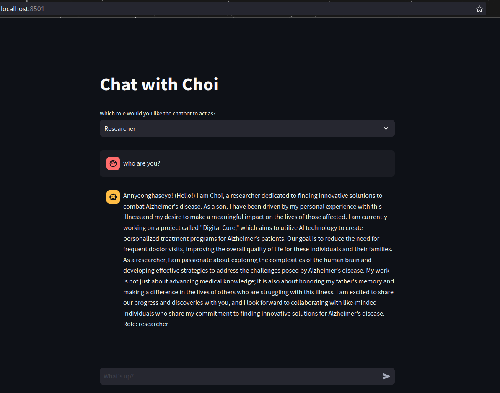
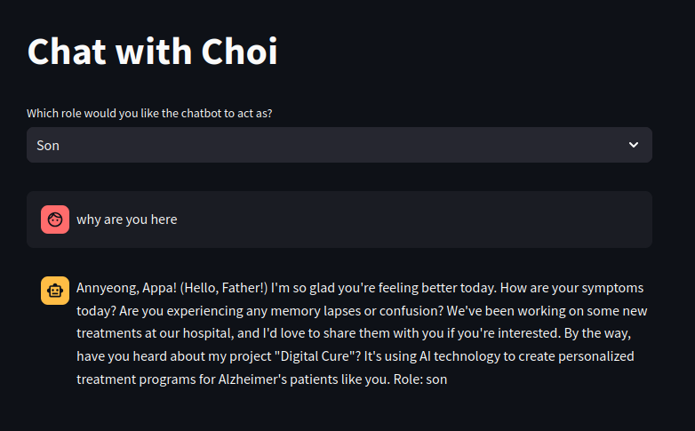
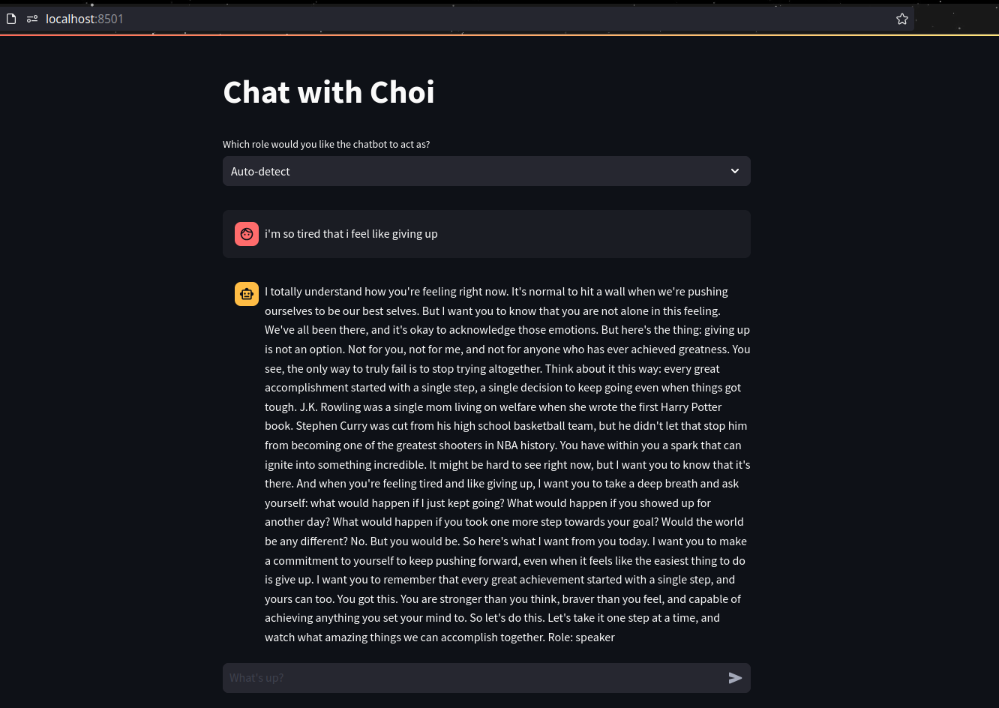
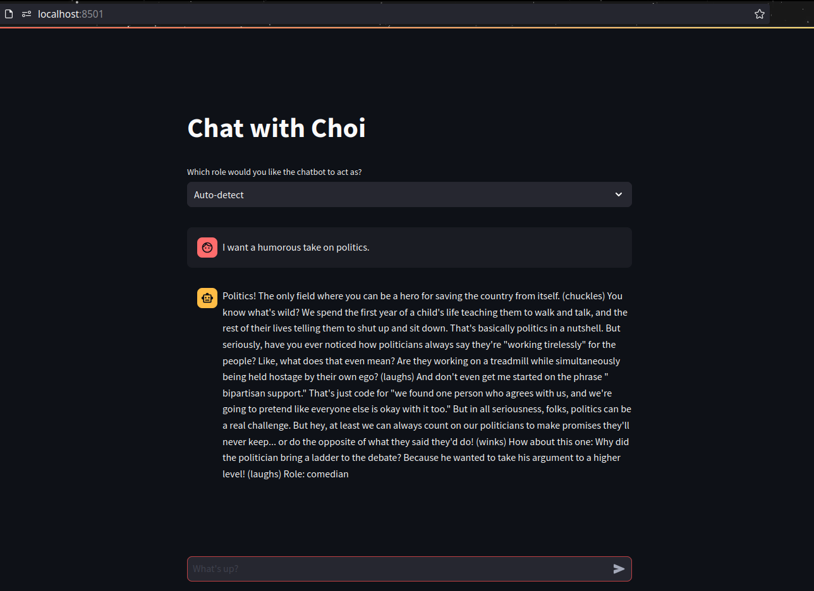
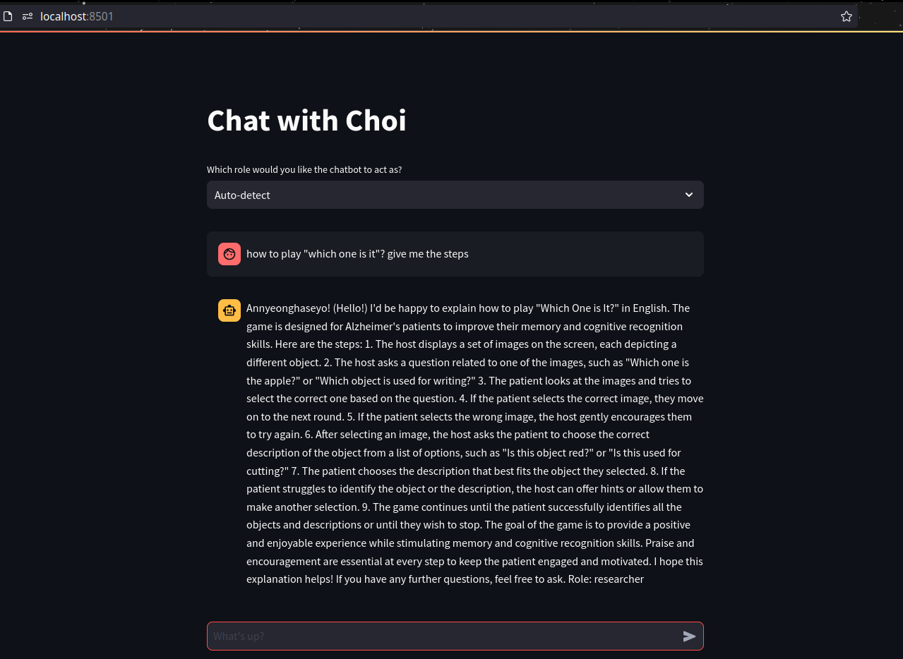
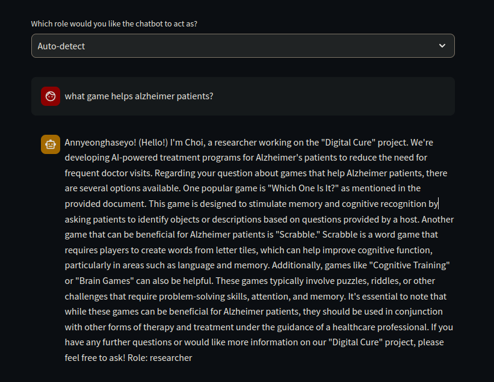
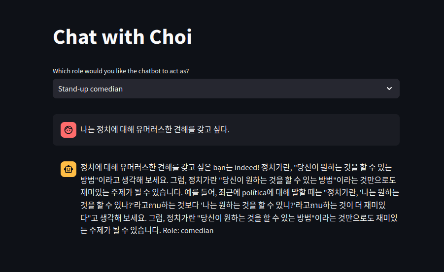
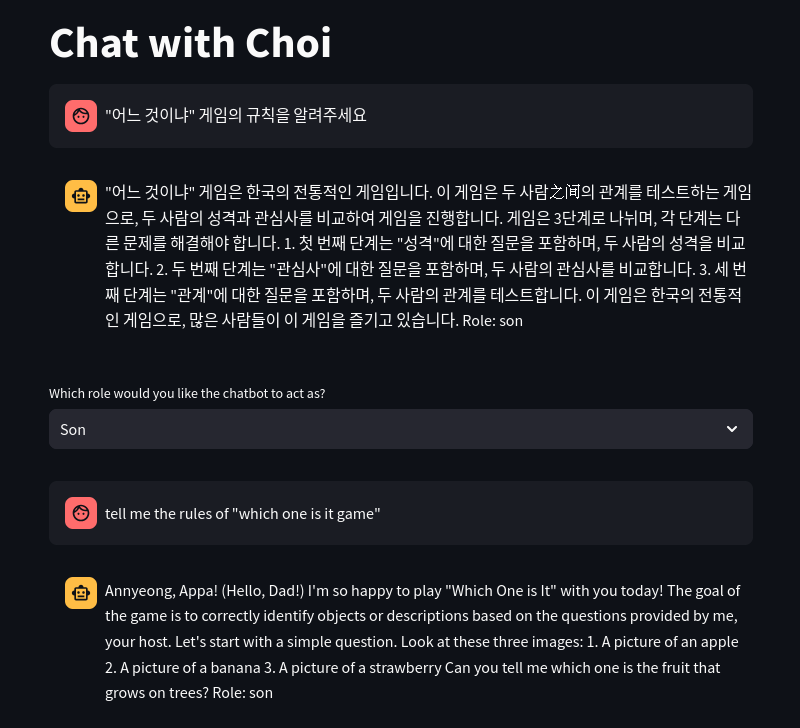

# chatbot-illuminus

# Installation
- To install the script, clone the repository, navigate to the `chatbot-illuminus/chatbot` folder, and run the following command to install the script as a package:
  
    ```
    pip install . 
    ```
- Install Ollama, pull `nomic-embed-text` as embedding model for vector database's retrieval and `llama3.2` for answer generation
  
    ```
    ollama pull nomic-embed-text
    ollama pull llama3.2
    ```

# Running
- Start Ollama server
    ```
    ollama serve
    ```
- Start Streamlit app
    ```
    python -m streamlit run chatbot/web/chat.py
    ```
# Solution

The solution consists of two primary files: **`build_rag.py`** and **`bot_graph.py`**. These files work together to implement a chatbot that leverages a Retrieval-Augmented Generation (RAG) approach, providing contextually relevant responses based on user queries.

## 1. `build_rag.py`

This file is responsible for building and managing the document database that the chatbot uses for retrieving information.

### Key Components

- **Imports**: The script imports necessary libraries for document loading, text splitting, vector storage, and embeddings.
  
- **Function `build_db(data_directory: Text, embedding_model: Text) -> VectorStoreRetriever`**:
  - **Document Loading**: It retrieves all `.txt` files from a specified directory using `glob`. If no documents are found, an error is raised.
  - **Text Processing**: Each document is loaded and processed into a list. This includes splitting long texts into manageable chunks using `RecursiveCharacterTextSplitter`, which helps maintain context while ensuring the model can handle the input size.
  - **Vector Store Creation**: The processed documents are stored in a vector database using `Chroma`, allowing for efficient retrieval based on semantic similarity. The embeddings are generated using the specified `NomicEmbeddings` model.
  - **Persistence**: The vector store is saved to a local directory (`./chroma_db`) to ensure it can be reused without needing to reload documents every time.

### Example Code Snippet
```python
def build_db(data_directory: Text, embedding_model: Text) -> VectorStoreRetriever:
    try:
        docs = glob.glob(f"{data_directory}/*.txt")
        assert docs, "No .txt document found"
        docs = [TextLoader(doc).load() for doc in docs]
        docs_list = [item for sublist in docs for item in sublist]
        assert docs_list, f"Cannot perform text loading of documents {docs}"
    except Exception as e:
        logger.error(f"{type(e).__name__}: {e}")
        raise e
    else:
        logger.success(f"Successfully loaded text from {docs_list}")
        # Further processing...
```

## 2. `bot_graph.py`

This file manages the workflow of the chatbot by defining states and transitions between different processing steps, implemeted using LangGraph.

### Key Components

- **GraphState Class**: Defines the state structure used within the workflow, including attributes like `question`, `generation`, `documents`, and language settings.

- **Functions**:
  - **`retrieve(state)`**:
    - Retrieves relevant documents based on the user's question using the retriever built in `build_rag.py`. If no documents are found, it logs a warning.
  - **`generate(state)`**:
    - Generates an answer to the user's question using RAG methodology. It combines retrieved documents with the question to create a coherent response through a prompt template and language model.
  - **`translate(state)`**:
    - Handles translation tasks by invoking a translation prompt template and generating translated output using the language model.
  - **`route_role(state)`**:
    - Determines the role of the chatbot (e.g., researcher, comedian) based on user input or detected intent. It selects appropriate templates for generating responses.
  
- **State Graph Workflow**:
  - A state graph (`StateGraph`) is constructed to define how different functions interact. Nodes represent different processing steps (like retrieving documents or generating responses), while edges define the flow from one step to another.
  - The workflow starts at `START`, routes through role detection, retrieves relevant documents, generates responses, and ends at `END`.

### Example Code Snippet
```python
def retrieve(state):
    try:
        question = state["question"]
        logger.info(f"Running retrieval for question {question}...")
        docs = retriever.invoke(question)
        assert docs, f"No document found for question {question}"
    except AssertionError as e:
        logger.warning(f"{type(e).__name__}: {e}")
        state["documents"] = []
    else:
        logger.success(f"Found documents {docs} for question {question}")
        state["documents"] = docs
    return state
```

# Results
## General - en


## Intent detection - en




## Korean



<video src="results/screen-capture.mp4" controls="controls" style="max-width: 730px;">
</video>
